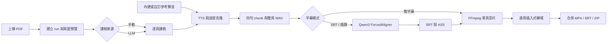

# SlideAI

將 PDF 投影片、逐頁講稿與參考聲音，轉為可下載的語音簡報影片。本專案以
**Linux 本地部署、可信任內網使用與可人工修正**為主，不把模型權重、簡報內容
或 API key 提交到 Git。

## 快速開始

建議環境：Ubuntu 24.04、NVIDIA GPU、Docker Compose v2、NVIDIA Container
Toolkit；完整語音工作流建議至少 16GB VRAM。

```bash
git clone https://github.com/g114056175/test_SlideAI.git
cd test_SlideAI
chmod +x slideai.sh
./slideai.sh
```

第一次請選 `6 建制`，依精靈選擇 Docker、模型來源／本機路徑及選用的 LLM。
完成後選 `1 啟動`；終端會顯示本次實際使用的 WebUI 與 API port。

```text
1) 啟動    2) 關閉    3) 重新啟動
4) 狀態    5) 設定    6) 建制
0) 離開
```

## 使用流程

1. 上傳 PDF，手動撰寫講稿或使用 LLM 產生逐頁講稿。
2. 選擇內建／自訂參考音色、語音速度及字幕模式。
3. 先渲染單頁試聽；可直接修改四句 chunk 的文字後局部重生。
4. 渲染全部，在 `ALL` 預覽合成影片，下載 MP4、SRT 或完整壓縮檔。

字幕模式：`無字幕` 最快且不做對齊；`輸出 SRT` 產生時間軸但不燒字；`燒錄字幕`
產生內嵌字幕影片並保留 SRT。多人同時使用時，渲染工作會依 FIFO 排隊並顯示階段
與頁面進度。

## 預設模型

| 功能 | 預設模型 |
|---|---|
| TTS／語音克隆 | [VoxCPM2](https://huggingface.co/openbmb/VoxCPM2) |
| ASR | [Qwen3-ASR-1.7B](https://huggingface.co/Qwen/Qwen3-ASR-1.7B) |
| 強制對齊 | [Qwen3-ForcedAligner-0.6B](https://huggingface.co/Qwen/Qwen3-ForcedAligner-0.6B) |
| 選用備援 TTS | [Qwen3-TTS-12Hz-1.7B-Base](https://huggingface.co/Qwen/Qwen3-TTS-12Hz-1.7B-Base) |

預設使用官方 VoxCPM2，優先相容性；建制精靈可選 Nano-vLLM 加速，會增加 CUDA／
FlashAttention 相依與顯存保留。公開 Hugging Face 模型可匿名下載，Token 僅在使用
私人或 gated 模型時需要。

## 效能概覽：5090 32GB 開發實測

以下是長中文文本、模型預熱後的約略 RTF（處理秒數／音訊或影片秒數）。不含首次載入、PDF 轉圖與排隊；文本、音色、驅動與顯存壓力都會影響結果。

| 模組／模式 | 約略 RTF | 說明 |
|---|---:|---|
| Qwen3-TTS 1.7B | `0.9–1.0` | 中英文及專有名詞較穩定，但速度不足以作預設。 |
| 官方 VoxCPM2 | `~0.3` | 環境較單純，適合作為一般設備預設。 |
| VoxCPM2 + Nano-vLLM | `0.11–0.13` | 速度主力；需要額外 CUDA／FlashAttention 相依。 |
| Qwen3 ForcedAligner | `~0.1` | 僅輸出 SRT／燒錄字幕時執行。 |
| ASS 字幕燒錄 | `~0.06` | 不需要內嵌字幕可略過。 |
| Nano 主流程 | `~0.25–0.35` | TTS、對齊、燒錄順序執行的常見總體級距。 |

Nano-vLLM 預設可使用 `VOXTTS_NANO_GPU_MEMORY_UTILIZATION=0.50`；16GB VRAM 約以 8GB 為目標預留工作空間，但能否運行仍取決於模型、驅動與其他 GPU 程序。worker 閒置會自動卸載。

## Agent API

不開 WebUI 也可提交 PDF、參考音檔與 JSON 工作單。範例在
[docs/agent-job.example.json](docs/agent-job.example.json)，完整格式、輪詢與輸出說明見
[deploy/README.md](deploy/README.md)。

<details>
<summary><strong>詳細說明：架構、設計取捨與開發紀錄</strong></summary>

> 本區預設收起。一般使用者只需閱讀前面的快速開始；需要理解程式、替換模型或檢視開發成果時，再展開個別章節。

<details>
<summary><strong>1. 系統架構與完整處理流程</strong></summary>



上傳時會把 PDF 保存到該次 run 的 `input/`，產生頁面預覽並建立 manifest。講稿可以完全手動輸入，也可以交給 Gemini、OpenAI、Claude、OpenRouter、xAI、Groq 或自訂 OpenAI-compatible endpoint。LLM 只負責講稿，不會直接控制檔案路徑或執行任意命令。

正式批次流程採「階段式」而非逐頁反覆切換模型：先完成所有頁面的 TTS，再釋放 TTS worker；需要字幕時才載入 ForcedAligner，完成對齊後再逐頁渲染。這能減少模型反覆載入時間，也避免 TTS 與對齊同時佔滿 GPU。

每一頁的 TTS、對齊與影片都會建立 variant。重新生成不會直接覆蓋唯一成果，使用者可以比較、刪除或選回先前版本。批次工作則持久化到 job 檔案，支援取消、失敗資訊與服務重啟後續查。

</details>

<details>
<summary><strong>2. Vue 前端與工作區設計</strong></summary>

前端採 Vue 單頁應用。主要工作區分成投影片縮圖、可收合的頁面產出 variant、中央預覽，以及講稿／語音／字幕三個設定面板。一般頁顯示本頁影片與局部修正；選擇 `ALL` 時則切換到合併預覽與集中下載，避免頁面操作和整體輸出混在一起。

早期若使用 Gradio，音訊播放本身容易完成，但難以把「預設音色、自訂音檔、參考逐字稿、波形、音量、速度、下載、variant 與 chunk 重生」整合成同一套互動。因此目前以 WaveSurfer.js 和自訂 Vue 元件實作播放器，並自行處理短音檔縮放、水平捲動、URL 回收與容器尺寸變化。

前端只負責呈現狀態與送出請求；run、job、variant 的真實狀態保存在後端 artifact。按鈕鎖只能避免同一瀏覽器重複點擊，後端另有 job 與 manifest 鎖，避免多個瀏覽器同時送出造成資料競爭。

多人同時「渲染全部」時採 FIFO。等待者能看見前方工作數、自己目前是 TTS／對齊／渲染哪個階段，以及頁面 `i/n` 進度，但不會取得其他使用者的講稿或檔名。LLM 多頁生成另有限制併發，預設最多同時呼叫三頁，避免瞬間撞到 API rate limit。

目前桌面操作是主要目標；窄畫面已有收合與基本自適應，但尚未把完整工作區重新設計為手機優先介面，因此手機上可查看，複雜編輯仍建議使用桌面瀏覽器。

</details>

<details>
<summary><strong>3. TTS 選型、長文穩定與顯存生命週期</strong></summary>

開發期間比較過 Qwen3-TTS 1.7B、0.6B、官方 VoxCPM2 與 Nano-vLLM VoxCPM2。Qwen3-TTS 的中英文與部分專有名詞較穩定，但 5090 上約 0.9–1.0 RTF；0.6B 並未得到足以改變工作流的加速。官方 VoxCPM2 約 0.3 RTF，Nano-vLLM 可降至 0.11–0.13 RTF，因此目前以官方 VoxCPM2 作相容性預設、Nano-vLLM 作速度選項、Qwen3-TTS 作選用品質備援。

Nano-vLLM 不是只把模型換成另一個 class：專案加入相容 adapter，讓它維持原本 VoxCPM 的 prompt audio／prompt text 呼叫語意；預設 12 inference steps、CFG 2.0，並可限制 GPU memory utilization。先前出現特定音色像粵語的問題，最後確認與測試批次的前處理及呼叫條件有關，而非繁體中文必然無法使用；正式 WebUI 會完整沿用同一份參考音頻與逐字稿，不做多次回滾克隆。

TTS worker 可預熱，但不永久佔用 GPU。Nano-vLLM、Qwen TTS 和對齊 worker 均有閒置卸載；進入下一階段時也會主動釋放前一個模型。這是為了讓 16GB 顯存設備仍有機會運作，也避免單人低頻使用時長時間佔住 20GB 以上顯存。

</details>

<details>
<summary><strong>4. 中英文斷句與四句 chunk 規則</strong></summary>

斷句不是單純看到任何句點就切。中文主要識別 `，、。！？；…` 與換行；英文 `.` 只有符合句尾條件才切，並排除小數、版本號、IP、常見縮寫與連續英文 token，例如 `1.23GB`、`CUDA 13.0`、`e.g.`、`Dr.` 不應被拆開。

句子完成後，預設每四句組成一個 TTS chunk。選擇四句的原因是：

- 整頁長文一次生成，後段較容易聲線、語速與克隆相似性漂移。
- 完全逐句生成雖容易定位時間，卻會失去上下文，句與句之間語氣可能突兀。
- 四句保留足夠語境，也讓錯誤時只需重生局部，而不是整頁重跑。

chunk 之間加入約 120ms 靜音，再合併為整頁 WAV；每段原始 WAV、文字、起訖與時長都會寫進 sidecar。字幕顯示的分段和 TTS chunk 是兩個層次：TTS chunk 為生成穩定性服務，字幕仍可在 chunk 內依可讀性切成多行短句。

局部文字框允許改字，也可不改字只重試發音。若文字或音長改變，系統會替換該 chunk、重組整頁 WAV、同步整頁講稿，再重新做整頁對齊與本頁渲染；不能只對後續字幕加固定秒數，因模型停頓和語速並非線性。

</details>

<details>
<summary><strong>5. 強制對齊、二次修正與字幕切分</strong></summary>

ASR 與 ForcedAligner 的用途不同。ASR 主要用於取得自訂參考音檔的逐字稿或診斷；正式影片已知講稿，因此字幕文字以原講稿為準，再由 Qwen3 ForcedAligner 找到字詞時間。這可避免 ASR 把模型名、人名或專有詞辨識錯後直接寫入字幕。

對齊後還有數字／單位二次修正，用來處理 tokenizer 可能把 `900px`、`1.23GB`、`CUDA 13.0` 拆成不同形式的情況。修正會在正規化文字與原始字元位置之間建立映射，再局部校正，不重新跑完整 ASR。這能提高特殊 token 的時間軸穩定性，但遇到大量數字時會增加處理時間，因此目前保留正確性優先的做法。

字幕切分已知完整講稿，核心問題不是猜字，而是決定畫面每次顯示多少字。規則會優先使用句末與弱標點、限制最短／最長字數、避免標點落在下一行開頭、避免產生極短孤立片段，並針對中英混合、括號、英文單字和數字單位保護不可拆區段。若最後一段太短，會在不破壞強句界的前提下和相鄰段合併。

對齊品質警告採低干擾策略。正常的「講稿 → TTS → 對齊」通常誤差不大，因此只有缺失比例、時間覆蓋或文字映射達到嚴重門檻才提示；警告會回傳到 UI，但不因輕微分數波動阻止產出。

</details>

<details>
<summary><strong>6. 字幕輸出與渲染方案取捨</strong></summary>

| 方案 | 優點 | 缺點 | 結論 |
|---|---|---|---|
| HTML/CSS 預覽 | 即時、容易調色與排版 | 正式錄製受瀏覽器、字型與 frame timing 影響 | 適合 UI，不作主要輸出 |
| Canvas／Skia | 完全掌控像素與動畫 | 逐幀繪製成本高，Node 相依和長片維護較重 | 曾測試，非預設 |
| Remotion | 可使用 React/CSS 動畫概念 | 啟動、bundle 與渲染成本較高 | 適合特殊動畫 fallback |
| ASS + FFmpeg | 字型、描邊、底色、位置與逐字效果穩定 | 自由度低於 DOM | 目前正式主流程 |

最終提供三種模式：`無字幕` 不執行對齊且最快；`輸出 SRT` 做對齊但不重編字幕畫面；`燒錄字幕` 產生 ASS 並由 FFmpeg 寫入影片，同時保留 SRT。若影片上傳 YouTube，SRT 才能提供可靠的人工講稿時間軸；只交逐字稿給平台仍可能由自動字幕重新辨識而產生錯字。

ASS 被選為主流程，是因為它能在 1920×1080 輸出下穩定控制字體、邊框、背景透明度、垂直位置和逐字高亮，生成速度也比逐幀 Canvas 更適合長影片。預覽與最終輸出仍可能受瀏覽器播放器縮放影響，因此視覺參數保存於 run settings，渲染時以固定畫布計算。

</details>

<details>
<summary><strong>7. 單頁影片、轉場與合併最佳化</strong></summary>

每頁先以投影片影像、整頁音訊及選定字幕模式產生獨立 MP4。好處是單頁可重生、可保留多個 variant，也能跳過未渲染頁。早期開啟轉場時，FFmpeg 會用一個大型 `xfade` graph 重編整片，12 頁測試約需 25 秒。

目前改為插入式轉場：只利用相鄰兩張頁面圖片生成 `n-1` 個約 0.42 秒的 bridge，然後依「第 1 頁、1→2 bridge、第 2 頁……」concat。相同測試約降至 4.5 秒；原始單頁影片不需重編碼。合併 SRT 會把每個 bridge 的時間累積進後續字幕 offset。

轉場目前由系統從已驗證效果中自動選擇，可完全關閉。開發中排除了視覺容易產生雜訊或過度閃爍的效果；未來若開放逐頁選擇，也應保存為合併設定，而不改動單頁原始影片。

</details>

<details>
<summary><strong>8. Artifact 資料結構、鎖與不用 SQL 的理由</strong></summary>

```text
data/video_runs/<run-id>/
├── input/                  # 原始 PDF、可選參考音檔
├── manifest.json           # 設定、頁面、目前 variant、狀態
├── pages/<page>/variants/  # WAV、chunks、alignment、SRT、MP4
├── jobs/                   # 批次工作、進度、取消與錯誤
└── merged/                 # 合併 MP4、SRT、下載 bundle
```

目前是單機／研究室工具，artifact-first 比 SQL 更容易直接檢查、備份、回檔與續跑；每個 run 自帶完整上下文，搬移時不需要重建資料庫關聯。manifest 更新使用程序鎖與原子替換，避免縮圖背景執行緒、批次 worker 和 UI 同時寫入而遺失欄位。

`data/database/` 的 SQLite 主要是舊版帳號與應用相容資料，不是影片工作流的唯一真實來源。如果未來要支援公開註冊、多租戶隔離、跨機 worker、計費或數十萬個專案查詢，才應把 metadata 與排程移到 PostgreSQL／Redis；大型音訊與影片仍應留在檔案或 object storage。

</details>

<details>
<summary><strong>9. 建制、模型替換與網路安全邊界</strong></summary>

Docker Compose 管理 Vue 前端與 FastAPI 後端；模型權重由主機路徑唯讀掛載，不寫進 image。TTS、ASR、ForcedAligner 分開 runtime，是為了隔離 Torch、Transformers 與 FlashAttention 版本。`slideai.sh` 建制精靈可下載公開 HF 模型、指定既有路徑、選擇是否建置 Nano-vLLM，以及設定 LLM 與 HF Token。

provider 可改成本地 command adapter 或商用 API；介面見 [docs/SPEECH_ADAPTERS.md](docs/SPEECH_ADAPTERS.md)。理想的 provider capability 應宣告是否需要參考音檔、參考逐字稿、是否支援克隆及是否直接回傳時間軸。多數本地 TTS 沒有通用且可靠的字詞時間，因此目前仍由 ForcedAligner 統一處理。

預設是可信任內網免登入，不能直接當公開 SaaS。開發展示曾使用 `https://awinlab-gate.g114056175.me/`；網址可能過期或關閉，並非必要部署。概念鏈路為：

```text
使用者 → Cloudflare Proxy / Zero Trust 真人驗證
        → Worker 密碼閘門 → SlideAI 前端與 API
```

Cloudflare 能降低掃描與未授權流量，但不取代應用層登入、權限隔離、rate limit、上傳限制與更新管理。若改為未知外部使用者，必須重新啟用這些機制。

</details>

<details>
<summary><strong>10. 主要開發修正與後續方向</strong></summary>

已完成的關鍵修正包括：TTS 模型比較與 Nano-vLLM 相容層；四句 chunk 與繁中／英文斷句；TTS 完批後才切換 ForcedAligner；worker 閒置卸載；字幕三模式；對齊數字／單位修正；ASS 正式輸出；局部音訊重生後重做時間軸；manifest 程序鎖；持久化 batch job、取消與 FIFO；影片串流處理；插入式轉場；單一 `slideai.sh` 建制精靈；動態 port；Agent API；Google 新版 GenAI SDK；以及模型、環境檔與 run artifact 的 Git 排除。

仍值得繼續的方向：

- provider capability schema 與每個 provider 的契約測試。
- 將各階段耗時、冷／熱啟動、RTF 與 GPU 峰值寫入結構化 run metrics。
- 匯出 YouTube 章節文字，但維持人工上傳，避免帳號與誤發布風險。
- 以固定模板、嚴格 JSON schema 建立 HTML 動態簡報模組，並讓講稿帶觸發點。
- PDF OCR 聚焦／Zoom 僅在高可信頁面啟用；若無法穩定辨認同類物件，寧可不加效果。
- 完成手機版工作區、SQLAlchemy 新 API 與 Python 3.13 前的 passlib 替代。

部署檢查可執行 `scripts/portability_check.sh` 與 `scripts/smoke_test.sh`；`--full` 會實際載入模型並生成影片。

</details>

</details>
